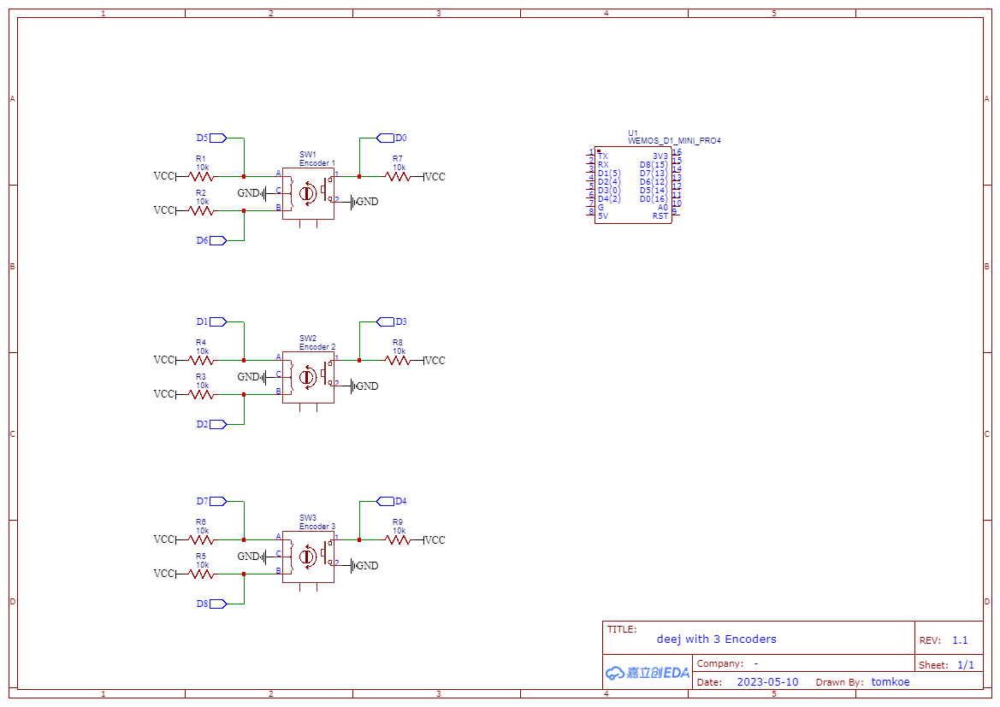

# deej with 3 (6) encoders

- This branch uses 3 encoders, instead of sliders/ potentiometers. Each encoder has a normal value and a second value if you press the encoder button whilst turning. For a total of 6 "sliders".
- The desktop app is the same, go check out the main branch for that [https://github.com/omriharel/deej/releases/latest.](https://github.com/omriharel/deej)
- The build is tiny and has tactile feedback on the knobs.
- The main dissadvantage is that the encoders do not keep their position if power is lost. 

## Hardware
- The board connects via a USB cable to the PC
- [Warning] To be able to flash the code you need to disconnect pin 8
- The main controller is a Wemos D1 mini clone (>5€, if bought directly from china)
- The encoders are without a breakout board (>5€ in total)

#### Schematic

### Software

- [Warning] To be able to flash the code you need to disconnect pin 8
- The code running on the Wemos is a [C program](./arduino/main.ino) constantly writing current encoder values over its serial interface
- In the Wemos code you can easily change some settings at the top (like starvalues, stepsize)
- Thanks to https://forum.arduino.cc/t/reading-rotary-encoders-as-a-state-machine/937388 for parts of the encoder code.

## License

deej is released under the [MIT license](./LICENSE).
